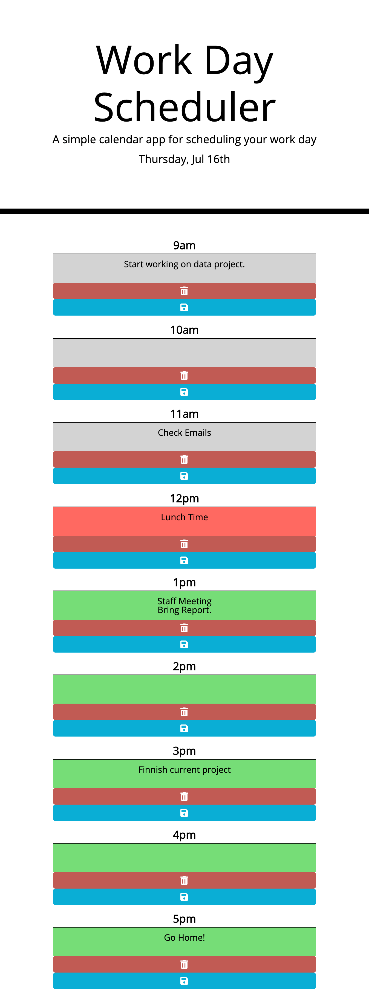

# day_planner
This day planner lets you know what day it is and lists your workday schedule from 9am to 5pm, highlighting the current hour, greying out the past hours and leaving the future hours in green. It allows you to enter your to-do's in each of the time slots where you can save them or delete them individually using local storage. 
This day planner utilizes Moment.js, JQuery, Bootstrap, FontAwesome, functions, loops, and more. The HTML and CSS have been validated through validation services.

[Click Here to check it out!](https://jacoblovins.github.io/day_planner/)

Full Screen:

Small Screens:

    